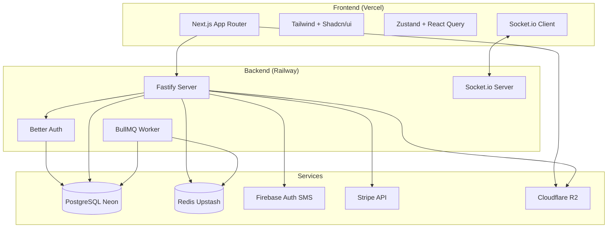
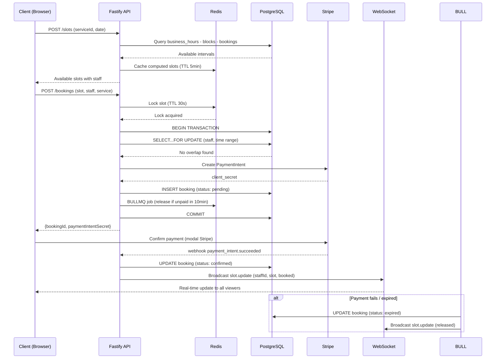
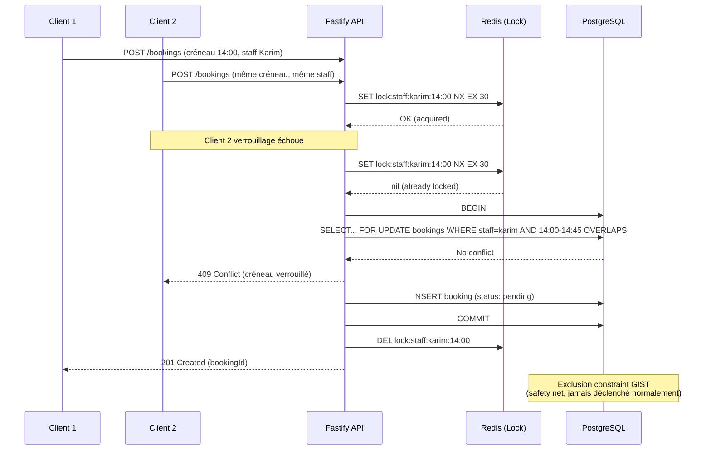

# PSTAGEV1 — Plateforme de Réservation pour Salons & Instituts de Beauté (Maroc)

**Propriétaire:** @lonewolf
**Statut:** DRAFT
**Date:** 2026-06-22
**Version:** 1.0

---

## Parties prenantes
- @backend
- @frontend
- @security
- @product

---

## Document Status Reference

| Statut | Quand | Action |
|--------|-------|--------|
| DRAFT | Travail en cours | Document de travail |
| APPROUVÉ | Examiné et approuvé | Version approuvée |
| ARCHIVÉ | Obsolète | Plus actif |

---

## 0) Vue d'ensemble

Plateforme SaaS verticale de réservation en ligne pour les salons de coiffure et instituts de beauté au Maroc, sur le modèle de Planity (France). Permet aux clients de trouver, comparer et réserver des prestations en ligne avec paiement intégré. Offre aux professionnels un dashboard complet de gestion d'agenda, d'équipe et de catalogue.

Le produit gère **deux types de prestataires** :
- **Établissements** : salons/instituts avec plusieurs employés (staff)
- **Indépendants** : auto-entrepreneurs seuls (coiffeur à domicile, etc.)

### Contexte
- Marché marocain des salons/instituts largement non digitalisé
- Concurrents (annuaires génériques) n'offrent pas de réservation en ligne fonctionnelle
- Modèle 100% opt-in : aucune fiche sans inscription réelle du prestataire (pas de scraping)
- Projet de stage ingénieur (2e année, ENSIASDT)
- Stack TypeScript end-to-end : Next.js 14 + Fastify + Prisma + PostgreSQL + Redis

### Objectifs
- Offrir un moteur de réservation fiable avec anti-double-booking garanti
- Fournir aux clients une expérience fluide : recherche → sélection → paiement → confirmation
- Fournir aux professionnels un outil métier complet : agenda, staff, catalogue, analytics
- Assurer la synchronisation temps réel des disponibilités via WebSocket
- Garantir l'isolation multi-tenant stricte

### Non-Objectifs
- Application mobile React Native (V1 post-stage)
- Intégration IA (Vercel AI SDK — V1 post-stage)
- Paiement CMI marocain natif (Stripe test mode suffit pour la démo)
- Multi-établissements pour un même compte (plan Business — post-MVP)
- Support d'autres verticales (médecins, restaurants, etc.)
- Réservation anonyme/invité (compte requis)

---

## Fonctionnalités

### FONCTIONNALITÉ 1 — Authentification et Comptes

**Objectif:** Gérer l'inscription et la connexion des clients et des professionnels avec vérification téléphone + email.

#### Logique fonctionnelle

**R-FUNC-001** [P0] Le système DOIT permettre l'inscription avec email, téléphone et nom pour tous les utilisateurs `maps_to: AC#12`

**R-FUNC-002** [P0] Le système DOIT vérifier le numéro de téléphone via un code OTP envoyé par Firebase Auth (tier gratuit SMS) `maps_to: AC#12`

**R-FUNC-003** [P0] Le système DOIT vérifier l'adresse email via un lien OTP `maps_to: AC#12`

**R-FUNC-004** [P0] Le système DOIT fournir une authentification par email/mot de passe avec gestion de session JWT via Better Auth `maps_to: AC#12`

**R-FUNC-005** [P0] Le système DOIT limiter les réservations aux seuls utilisateurs connectés avec téléphone + email vérifiés `maps_to: AC#9`

**R-FUNC-006** [P1] Le système DOIT permettre la mise à jour du profil (nom, email, téléphone) avec re-vérification si changement `maps_to: AC#12`

**R-FUNC-007** [P1] Le système DOIT implémenter la limitation du débit sur les tentatives de connexion (max 5 tentatives / 15 min) `maps_to: AC#12`

#### Changements du modèle de données
- Table `users` gérée par Better Auth : `id`, `email`, `phone`, `phoneVerified`, `name`, `passwordHash`, `role`
- Relations vers `providers` (owner) et `bookings` (client)

#### Questions ouvertes
1. Durée de validité des jetons de session ? (proposition : 24h défaut, 7j si "remember me")

---

### FONCTIONNALITÉ 2 — Onboarding et Gestion du Prestataire (Back-office)

**Objectif:** Permettre à un professionnel de créer et configurer son espace de travail complet.

#### Logique fonctionnelle

**R-FUNC-008** [P0] Le système DOIT permettre l'inscription d'un prestataire avec choix du type : `establishment` ou `individual` `maps_to: AC#1`

**R-FUNC-009** [P0] Pour un `establishment`, le système DOIT permettre d'ajouter/modifier/supprimer des membres du staff (nom, photo, bio, actif/inactif) `maps_to: AC#3`

**R-FUNC-010** [P0] Pour un `individual`, le système DOIT créer automatiquement un membre staff représentant la personne `maps_to: AC#3`

**R-FUNC-011** [P0] Le système DOIT permettre de configurer les horaires d'ouverture récurrents par jour de semaine `maps_to: AC#2`

**R-FUNC-012** [P1] Le système DOIT permettre d'ajouter des jours d'exception (congés, fermeture exceptionnelle) via des ScheduleBlocks `maps_to: AC#2`

**R-FUNC-013** [P1] Le système DOIT permettre de marquer un staff comme en congé/absence via ScheduleBlock (date début → date fin) `maps_to: AC#3`

**R-FUNC-014** [P0] Le système DOIT permettre de créer un catalogue de prestations : nom, durée (minutes), prix (centimes), buffer de nettoyage (minutes) `maps_to: AC#4`

**R-FUNC-015** [P0] Le système DOIT permettre d'assigner chaque prestation à un ou plusieurs membres du staff `maps_to: AC#4`

**R-FUNC-016** [P1] Le système DOIT permettre de désactiver/reactiver une prestation sans la supprimer `maps_to: AC#4`

**R-FUNC-017** [P0] Le système DOIT permettre le blocage manuel de créneaux depuis le dashboard (walk-in) avec répercussion temps réel `maps_to: AC#7`

#### Changements du modèle de données
- Table `providers`: `id`, `type` (establishment|individual), `name`, `slug`, `description`, `phone`, `email`, `address`, `city`, `latitude`, `longitude`, `logo`, `status`
- Table `staff`: `id`, `providerId`, `name`, `photo`, `bio`, `isActive`
- Table `business_hours`: `id`, `providerId`, `dayOfWeek`, `openTime`, `closeTime`, `isClosed`
- Table `schedule_blocks`: `id`, `providerId`, `staffId?`, `type`, `startDatetime`, `endDatetime`, `title`
- Table `services`: `id`, `providerId`, `name`, `description`, `durationMinutes`, `priceCents`, `bufferMinutes`, `isActive`
- Table `service_staff` (N:N): `serviceId`, `staffId`

---

### FONCTIONNALITÉ 3 — Moteur de Créneaux et Réservation

**Objectif:** Cœur du produit — calculer les créneaux disponibles en temps réel et garantir l'absence de double-réservation.

#### Logique fonctionnelle

**R-FUNC-018** [P0] Le moteur DOIT calculer les créneaux disponibles à partir des horaires d'ouverture, moins les ScheduleBlocks, moins les réservations existantes `maps_to: AC#5`

**R-FUNC-019** [P0] Le moteur DOIT prendre en compte la capacité du prestataire (nombre de staff actifs) pour déterminer le nombre max de réservations simultanées `maps_to: AC#5`

**R-FUNC-020** [P0] Le système DOIT utiliser un verrou Redis (TTL 30s) lors de la tentative de réservation pour prévenir les conflits concurrents `maps_to: AC#6`

**R-FUNC-021** [P0] Le système DOIT utiliser une exclusion constraint PostgreSQL (GIST sur `staff_id + tstzrange`) comme filet de sécurité anti-double-booking `maps_to: AC#6`

**R-FUNC-022** [P0] Le flux de réservation DOIT être : sélection prestation → choix staff (par défaut ou manuel) → choix créneau → paiement → confirmation `maps_to: AC#9`

**R-FUNC-023** [P0] Le staff par défaut DOIT être le premier disponible (pas de réservation chevauchante sur ce créneau) `maps_to: AC#9`

**R-FUNC-024** [P0] Le client DOIT pouvoir changer de staff parmi ceux disponibles au même créneau `maps_to: AC#9`

**R-FUNC-025** [P0] Une réservation en attente de paiement DOIT passer en statut `pending` avec expiration à 10 minutes `maps_to: AC#8`

**R-FUNC-026** [P0] Un job BullMQ DOIT libérer automatiquement le créneau si le paiement n'est pas finalisé dans les 10 minutes `maps_to: AC#8`

**R-FUNC-027** [P0] Le système DOIT refléter instantanément tout changement de disponibilité via WebSocket (Socket.io) `maps_to: AC#7`

**R-FUNC-028** [P1] Le client DOIT pouvoir annuler sa réservation ; le créneau redevient immédiatement disponible `maps_to: AC#9`

**R-FUNC-029** [P1] Le prestataire DOIT pouvoir annuler une réservation depuis son dashboard `maps_to: AC#9`

#### Changements du modèle de données
- Table `bookings`: `id`, `providerId`, `serviceId`, `staffId`, `clientId`, `startDatetime`, `endDatetime`, `status` (pending|confirmed|cancelled|completed|expired), `paymentIntentId`, `paymentStatus`, `amountCents`

---

### FONCTIONNALITÉ 4 — Recherche et Découverte (Côté Client)

**Objectif:** Permettre aux visiteurs de trouver un prestataire sans avoir à créer un compte (compte requis seulement pour réserver).

#### Logique fonctionnelle

**R-FUNC-030** [P0] La recherche DOIT permettre de trouver des prestataires par ville `maps_to: AC#10`

**R-FUNC-031** [P1] La recherche DOIT proposer un filtre par type de prestataire (salon / indépendant) `maps_to: AC#10`

**R-FUNC-032** [P1] La fiche publique DOIT afficher : nom, photos, description, prestations avec prix, équipe, avis `maps_to: AC#10`

**R-FUNC-033** [P2] La recherche DOIT supporter la géolocalisation par rayon (PostGIS) `maps_to: AC#10`

**R-FUNC-034** [P0] La consultation des fiches et des créneaux DOIT être accessible sans authentification `maps_to: AC#9`

#### Changements du modèle de données
- Extension PostGIS sur `providers.latitude` + `providers.longitude`
- Index sur `providers.city` et `providers.type`

---

### FONCTIONNALITÉ 5 — Dashboard Professionnel

**Objectif:** Interface de gestion quotidienne pour le prestataire.

#### Logique fonctionnelle

**R-FUNC-035** [P0] Le dashboard DOIT afficher l'agenda du jour/semaine avec les réservations par membre du staff `maps_to: AC#11`

**R-FUNC-036** [P1] Le dashboard DOIT permettre de bloquer manuellement un créneau directement depuis la vue agenda `maps_to: AC#11`

**R-FUNC-037** [P1] Le dashboard DOIT afficher des statistiques : nombre de RDV, taux de remplissage, chiffre d'affaires estimé `maps_to: AC#11`

**R-FUNC-038** [P0] Le dashboard DOIT notifier le prestataire en temps réel des nouvelles réservations et annulations `maps_to: AC#11`

---

### FONCTIONNALITÉ 6 — Avis Clients

**Objectif:** Permettre aux clients d'évaluer les prestataires après une prestation.

#### Logique fonctionnelle

**R-FUNC-039** [P1] Le client DOIT pouvoir laisser un avis (note 1-5 + commentaire) après une réservation confirmée `maps_to: AC#14`

**R-FUNC-040** [P1] Le prestataire PEUT répondre aux avis reçus `maps_to: AC#14`

**R-FUNC-041** [P1] Un avis est lié à une réservation unique (1 réservation = 1 avis maximum) `maps_to: AC#14`

#### Changements du modèle de données
- Table `reviews`: `id`, `providerId`, `bookingId` (unique), `clientId`, `rating`, `comment`, `reply`, `createdAt`

---

### FONCTIONNALITÉ 7 — Paiements et Abonnements

**Objectif:** Gérer les paiements des clients (réservation) et les abonnements SaaS des prestataires.

#### Logique fonctionnelle

**R-FUNC-042** [P0] Le système DOIT accepter les paiements par carte via Stripe en mode test pour le MVP `maps_to: AC#14`

**R-FUNC-043** [P0] Le système DOIT vérifier la signature Stripe webhook pour chaque événement de paiement `maps_to: AC#14`

**R-FUNC-044** [P1] Le système DOIT gérer les abonnements SaaS (Free / Pro / Business) via Stripe `maps_to: AC#14`

**R-FUNC-045** [P1] Le plan Free DOIT permettre d'avoir une fiche visible sans réservation en ligne `maps_to: AC#14`

**R-FUNC-046** [P1] Le plan Pro DOIT activer la réservation en ligne, les analytics et la mise en avant dans la recherche `maps_to: AC#14`

**R-FUNC-047** [P2] Le plan Business DOIT permettre la gestion multi-établissements et l'accès API `maps_to: AC#14`

#### Changements du modèle de données
- Table `subscriptions`: `id`, `providerId`, `plan` (free|pro|business), `status`, `stripeSubscriptionId`, `currentPeriodStart`, `currentPeriodEnd`

---

### FONCTIONNALITÉ 8 — Isolation Multi-tenant

**Objectif:** Garantir qu'aucun prestataire ne peut accéder aux données d'un autre.

#### Logique fonctionnelle

**R-FUNC-048** [P0] Toute requête sur les données métier DOIT filtrer par `providerId` `maps_to: AC#13`

**R-FUNC-049** [P0] Les staff, services, réservations et avis DOIVENT être scopés au provider propriétaire `maps_to: AC#13`

**R-FUNC-050** [P1] Le dashboard DOIT utiliser un middleware qui injecte systématiquement le providerId de l'utilisateur connecté `maps_to: AC#13`

---

## Exigences de sécurité

### Modèle de menace (STRIDE)

#### Spoofing (Usurpation d'identité)
- **Actifs:** Comptes clients, comptes prestataires, jetons JWT
- **Acteurs:** Attaquants externes, bots
- **Points d'entrée:** API d'auth, formulaire de connexion
- **Frontières de confiance:** Client ↔ Serveur
- **Flux à haut risque:** Inscription, connexion, OTP SMS
- **Contrôles:** OTP Firebase, bcrypt, limitation du débit

#### Tampering (Altération)
- **Actifs:** Réservations, créneaux, données de paiement
- **Acteurs:** Clients malveillants, prestataires concurrents
- **Points d'entrée:** API Booking, dashboard, WebSocket
- **Frontières de confiance:** Client ↔ Serveur, Stripe ↔ Webhook
- **Flux à haut risque:** Création de réservation, blocage manuel, webhook Stripe
- **Contrôles:** Signature webhook Stripe, exclusion constraint PostgreSQL, atomicité des transactions

#### Repudiation (Répudiation)
- **Actifs:** Journaux d'audit des réservations et paiements
- **Acteurs:** Clients, prestataires
- **Points d'entrée:** API, dashboard
- **Frontières de confiance:** Système de journalisation
- **Flux à haut risque:** Annulation de réservation, modification de statut
- **Contrôles:** Historique des statuts, horodatage, traçabilité des actions

#### Information Disclosure (Divulgation d'informations)
- **Actifs:** Agenda des prestataires, données clients (téléphone, email)
- **Acteurs:** Autres prestataires, concurrents
- **Points d'entrée:** API publique, WebSocket, dashboard
- **Frontières de confiance:** Entre les providers (multi-tenant)
- **Flux à haut risque:** Consultation d'agenda, recherche, profil public
- **Contrôles:** Isolation multi-tenant stricte, filtrage systématique par providerId

#### Denial of Service (Déni de service)
- **Actifs:** Disponibilité du moteur de réservation
- **Acteurs:** Bots, attaquants
- **Points d'entrée:** API de recherche, endpoint de créneaux
- **Frontières de confiance:** Réseau, équilibreur de charge
- **Flux à haut risque:** Calcul de créneaux, recherche, OTP SMS
- **Contrôles:** Rate limiting, cache Redis des créneaux, limitation Firebase OTP

#### Elevation of Privilege (Élévation de privilèges)
- **Actifs:** Dashboard prestataire, données d'autres providers
- **Acteurs:** Prestataires
- **Points d'entrée:** Dashboard, API back-office
- **Frontières de confiance:** Entre les providers (multi-tenant)
- **Flux à haut risque:** Consultation de données d'un autre provider
- **Contrôles:** Middleware providerId injecté, RBAC sur les rôles (client/owner/admin)

### Exigences de sécurité

**R-SEC-001** [P0] Le système DOIT utiliser TLS 1.3 pour toutes les communications `proof_hint: static`

**R-SEC-002** [P0] Les mots de passe DOIVENT être hachés avec bcrypt (cost ≥ 12) `proof_hint: static`

**R-SEC-003** [P0] La création de réservation DOIT être atomique avec verrouillage PostgreSQL (SELECT FOR UPDATE) dans une transaction `proof_hint: test`

**R-SEC-004** [P0] L'isolation multi-tenant DOIT être appliquée au niveau requête avec filtrage systématique par `providerId` `proof_hint: test`

**R-SEC-005** [P1] L'envoi d'OTP SMS DOIT être limité à 3 requêtes/heure par numéro `proof_hint: test`

**R-SEC-006** [P0] La signature des webhooks Stripe DOIT être vérifiée sur chaque événement `proof_hint: test`

**R-SEC-007** [P1] Les actions sensibles (annulation, modification de statut) DOIVENT être journalisées avec horodatage `proof_hint: test`

**R-SEC-008** [P0] Toutes les entrées utilisateur DOIVENT être validées et assainies `proof_hint: test`

### Cas d'abus

**AC-SEC-001** Un attaquant tente de réserver le même créneau qu'un autre client
- **Réponse:** L'exclusion constraint PostgreSQL + le verrou Redis empêchent la double réservation
- **Exigences:** R-FUNC-020, R-FUNC-021

**AC-SEC-002** Un prestataire tente d'accéder au dashboard d'un concurrent
- **Réponse:** Le middleware injecte le providerId depuis la session, pas depuis l'URL
- **Exigences:** R-FUNC-048, R-FUNC-049, R-SEC-004

**AC-SEC-003** Un attaquant tente de forcer l'OTP SMS
- **Réponse:** Rate limiting Firebase + limite de 3 tentatives/heure
- **Exigences:** R-SEC-005

**AC-SEC-004** Un client annule une réservation après avoir été servi
- **Réponse:** Seules les réservations confirmées et futures sont annulables ; historique conservé
- **Exigences:** R-FUNC-028

**AC-SEC-005** Un attaquant tente d'usurper un webhook Stripe
- **Réponse:** Vérification de la signature Stripe sur chaque événement
- **Exigences:** R-SEC-006

---

## Contrats API

### API-001: Inscription client

**Point de terminaison:** `POST /api/auth/register`

**Requête:**
```json
{
  "email": "string",
  "phone": "string (format marocain)",
  "password": "string (min 8 chars)",
  "name": "string"
}
```

**Réponse (succès):**
```json
{
  "userId": "uuid",
  "requiresPhoneVerification": true,
  "requiresEmailVerification": true
}
```

**Codes d'erreur:**
- `AUTH-001`: Email déjà utilisé
- `AUTH-002`: Téléphone déjà utilisé
- `AUTH-003`: Format invalide

### API-002: Recherche de prestataires

**Point de terminaison:** `GET /api/providers?city={city}&type={type}&service={serviceId}`

**Réponse:**
```json
{
  "providers": [
    {
      "id": "uuid",
      "name": "string",
      "type": "establishment|individual",
      "slug": "string",
      "city": "string",
      "rating": "float",
      "services": [{"id": "uuid", "name": "string", "priceCents": "int"}],
      "logo": "string (url)"
    }
  ],
  "total": "int",
  "page": "int"
}
```

### API-003: Créneaux disponibles

**Point de terminaison:** `GET /api/providers/{slug}/slots?serviceId={uuid}&date={YYYY-MM-DD}`

**Réponse:**
```json
{
  "date": "2026-06-22",
  "service": {
    "id": "uuid",
    "name": "Coupe femme",
    "durationMinutes": 45,
    "priceCents": 25000,
    "bufferMinutes": 10
  },
  "slots": [
    {
      "start": "09:00",
      "end": "09:55",
      "staff": [
        {"id": "uuid", "name": "Karim", "available": true},
        {"id": "uuid", "name": "Sara", "available": true}
      ]
    }
  ]
}
```

### API-004: Création de réservation

**Point de terminaison:** `POST /api/bookings`

**Requête:**
```json
{
  "providerSlug": "string",
  "serviceId": "uuid",
  "staffId": "uuid (optionnel — null = auto-assign)",
  "startDatetime": "ISO 8601"
}
```

**Réponse (succès):**
```json
{
  "bookingId": "uuid",
  "status": "pending",
  "paymentIntentSecret": "string (Stripe)",
  "expiresAt": "ISO 8601"
}
```

### API-005: Annulation

**Point de terminaison:** `POST /api/bookings/{id}/cancel`

**Requête:**
```json
{
  "reason": "string (optionnel)"
}
```

**Réponse:**
```json
{
  "status": "cancelled",
  "slotReleased": true
}
```

### Événements WebSocket

**Connexion:** `ws://domain/ws/slots/{providerId}`

**Événements clients → serveur:**
```json
{
  "type": "subscribe",
  "payload": { "date": "2026-06-22", "serviceId": "uuid" }
}
```

**Événements serveur → clients:**
```json
{
  "type": "slot.update",
  "payload": {
    "slotStart": "09:00",
    "staffId": "uuid",
    "change": "booked|released",
    "capacityRemaining": 2
  }
}

{
  "type": "booking.confirmed",
  "payload": {
    "bookingId": "uuid",
    "staffId": "uuid",
    "serviceName": "Coupe femme",
    "clientName": "string",
    "startDatetime": "ISO 8601"
  }
}
```

### Codes d'erreur globaux

| Code | Signification | HTTP |
|------|---------------|------|
| `ERR-001` | Validation échouée | 400 |
| `ERR-002` | Non authentifié | 401 |
| `ERR-003` | Non autorisé (tenant mismatch) | 403 |
| `ERR-004` | Ressource introuvable | 404 |
| `ERR-005` | Conflit (créneau déjà réservé) | 409 |
| `ERR-006` | Trop de requêtes | 429 |
| `ERR-007` | Erreur interne | 500 |

---

## Matrice de vérification

| ID Exigence | Niveau | Type de preuve | Artefact | Notes |
|-------------|--------|----------------|----------|-------|
| R-FUNC-001 | MUST | test | test_user_registration | Inscription email + phone |
| R-FUNC-002 | MUST | test | test_phone_otp | Vérification OTP SMS |
| R-FUNC-003 | MUST | test | test_email_otp | Vérification email |
| R-FUNC-004 | MUST | test | test_login_session | Auth JWT |
| R-FUNC-005 | MUST | test | test_booking_auth | Réservation bloquée sans auth |
| R-FUNC-008 | MUST | test | test_provider_onboarding | Création provider |
| R-FUNC-009 | MUST | test | test_staff_crud | CRUD staff |
| R-FUNC-011 | MUST | test | test_business_hours | Horaires récurrents |
| R-FUNC-014 | MUST | test | test_service_crud | CRUD prestations |
| R-FUNC-018 | MUST | test | test_slot_engine_base | Calcul créneaux de base |
| R-FUNC-019 | MUST | test | test_slot_capacity_establishment | Capacité multi-staff |
| R-FUNC-020 | MUST | test | test_redis_lock_concurrent | Verrouillage concurrent |
| R-FUNC-021 | MUST | static | sql_exclusion_constraint | Contrainte GIST en place |
| R-FUNC-025 | MUST | test | test_pending_expiry | Expiration 10 min |
| R-FUNC-026 | MUST | test | test_bullmq_release | Job BullMQ libération |
| R-FUNC-027 | MUST | test | test_websocket_sync | Sync temps réel |
| R-FUNC-030 | MUST | test | test_search_by_city | Recherche par ville |
| R-FUNC-035 | MUST | test | test_dashboard_agenda | Agenda dashboard |
| R-FUNC-042 | MUST | test | test_stripe_payment | Paiement Stripe test |
| R-FUNC-048 | MUST | test | test_tenant_isolation | Isolation multi-tenant |
| R-SEC-001 | MUST | static | tls_config_check | TLS 1.3 |
| R-SEC-002 | MUST | static | bcrypt_config | bcrypt cost ≥ 12 |
| R-SEC-003 | MUST | test | test_booking_atomicity | Transaction atomique |
| R-SEC-004 | MUST | test | test_tenant_isolation_data | Filtrage providerId |
| R-SEC-006 | MUST | test | test_stripe_webhook_sig | Signature webhook |

---

## Plan de livraison

### LOT 1 — Structure du monorepo et configuration
- **Objectif:** Mettre en place l'infrastructure du projet
- **Couvre:** Fondation technique, outils, configs
- **Étapes:**
  1. Initialiser le monorepo Turborepo
  2. Configurer TypeScript, ESLint, Prettier
  3. Mettre en place les packages partagés (types, validation, utils)
  4. Configurer Prisma avec le schéma de base
  5. Configurer Docker Compose (PostgreSQL + Redis)
  6. Configurer les scripts de développement
- **Validation:** Le projet compile, la DB se migre, les conteneurs démarrent
- **Risques/Rollback:** Versions des dépendances — utiliser des versions pin

### LOT 2 — Authentification et comptes
- **Couvre:** R-FUNC-001 à R-FUNC-007, R-SEC-001, R-SEC-002, R-SEC-005
- **Étapes:**
  1. Intégrer Better Auth avec Prisma
  2. Configurer Firebase Auth pour SMS OTP
  3. Implémenter l'inscription client (email + téléphone + mot de passe)
  4. Implémenter la vérification téléphone (OTP) et email (lien)
  5. Implémenter la connexion et la gestion de session JWT
  6. Implémenter la limitation du débit sur les tentatives de connexion
- **Validation:** Inscription complète avec vérification, tests de rate limiting

### LOT 3 — Onboarding prestataire
- **Couvre:** R-FUNC-008 à R-FUNC-017, R-FUNC-048 à R-FUNC-050
- **Étapes:**
  1. Inscription prestataire (établissement ou individuel)
  2. Création et gestion du profil (infos, logo, localisation)
  3. Configuration des horaires d'ouverture récurrents
  4. Gestion du staff (CRUD, activation) + staff auto-créé pour les individuels
  5. Gestion des exceptions (ScheduleBlocks : congés, absences staff)
  6. Catalogue de prestations (services + assignment staff)
- **Validation:** Onboarding complet de bout en bout pour les deux types

### LOT 4 — Moteur de créneaux et réservation
- **Couvre:** R-FUNC-018 à R-FUNC-029, R-FUNC-042, R-FUNC-043, R-SEC-003, R-SEC-006
- **Étapes:**
  1. Implémenter le slot engine (window-based)
  2. Ajouter l'exclusion constraint PostgreSQL (GIST)
  3. Implémenter Redis lock pour la réservation concurrente
  4. Intégrer Stripe (paiement, création de PaymentIntent)
  5. Implémenter la réservation : sélection service → staff → slot → paiement
  6. Implémenter le job BullMQ pour l'expiration des paiements
  7. Implémenter l'annulation (client et prestataire)
  8. Implémenter le blocage manuel avec sync WebSocket
- **Validation:** Réservation complète, tests de concurrence (double-clic), tests d'expiration

### LOT 5 — Interface publique et recherche
- **Couvre:** R-FUNC-030 à R-FUNC-034
- **Étapes:**
  1. Page de recherche par ville (SSR)
  2. Filtre par type et prestation
  3. Fiche publique prestataire (infos, services, staff, avis)
  4. Widget de calendrier/créneaux (temps réel via WebSocket)
  5. PostGIS pour la recherche géographique (P2)
- **Validation:** Recherche fonctionnelle, consultation sans auth, créneaux en temps réel

### LOT 6 — Dashboard prestataire
- **Couvre:** R-FUNC-035 à R-FUNC-038
- **Étapes:**
  1. Vue agenda jour/semaine par staff
  2. Gestion des réservations (confirmer, annuler)
  3. Statistiques de base (RDV, remplissage, CA)
  4. Notifications temps réel (nouvelles réservations)
- **Validation:** Navigation dans l'agenda, blocage manuel, stats cohérentes

### LOT 7 — Avis et finalisation
- **Couvre:** R-FUNC-039 à R-FUNC-041
- **Étapes:**
  1. Système d'avis post-prestation
  2. Réponse du prestataire
  3. Affichage des avis sur la fiche publique
- **Validation:** Avis créé après réservation confirmée, réponse visible

### LOT 8 — Abonnements et mise en production
- **Couvre:** R-FUNC-044 à R-FUNC-047
- **Étapes:**
  1. Plans Free / Pro / Business avec Strive subscriptions
  2. Gating des fonctionnalités par plan
  3. Déploiement Vercel (frontend) + Railway (backend)
  4. Déploiement Neon (PostgreSQL) + Upstash (Redis)
- **Validation:** Downgrade/upgrade de plan, restrictions appliquées

---

## Exigences non fonctionnelles

### Performance
- Le calcul des créneaux ne DOIT pas prendre plus de 500ms pour un prestataire avec 10 staff sur une journée
- Le cache Redis DOIT être utilisé pour les créneaux pré-calculés des 7 prochains jours
- Les connexions WebSocket DOIVENT supporter jusqu'à 100 clients simultanés par prestataire
- Le temps de synchronisation temps réel NE DOIT PAS dépasser 2 secondes

### Disponibilité
- Le moteur de réservation DOIT être disponible 24/7 (objectif 99.5%)
- Les pannes Redis NE DOIVENT PAS bloquer les réservations (fallback sur PostgreSQL uniquement)
- Les jobs BullMQ DOIVENT être retentés en cas d'échec (max 3 tentatives)

### Stockage
- Les photos des prestataires et staff DOIVENT être stockées sur Cloudflare R2
- Les horodatages DOIVENT être stockés en UTC et convertis dans le fuseau du client

---

## Considérations sur les données

- **Volume estimé MVP:** 100 prestataires, 500 clients, 3000 réservations/mois
- **Stockage:** PostgreSQL Neon (serverless, scaling auto)
- **Cache Redis Upstash:** Créneaux pré-calculés + sessions + file BullMQ
- **Cloudflare R2:** Photos prestataires, staff, logos (stockage objet compatible S3)
- **Sauvegarde:** Backup automatique Neon (point-in-time recovery)

---

## Risques et atténuation

| Risque | Atténuation |
|--------|-------------|
| Concurrence sur les créneaux (deux clients réservent en même temps) | Redis lock + Exclusion constraint PostgreSQL + SELECT FOR UPDATE |
| Échec du fournisseur SMS Firebase | Logging + fallback email OTP ; surveiller le quota gratuit |
| Fraude à l'OTP (force brute) | Rate limiting Firebase + limite de 3 tentatives/heure |
| Fuite de données entre prestataires | Middleware providerId systématique + tests d'isolation |
| Webhook Stripe non reçu | Polling périodique des PaymentIntents + job BullMQ de rattrapage |
| Panne Redis | Le moteur de réservation passe en mode degraded (PostgreSQL uniquement) |
| Abandon en cours de paiement (créneau bloqué) | BullMQ libère le créneau après 10 min + UI montre le compte à rebours |

---

## Résumé des clarifications ouvertes

1. Durée de validité des jetons de session ? (proposition : 24h défaut, 7j si "remember me")
2. Faut-il un CAPTCHA à l'inscription pour prévenir les bots ? (proposition : oui, Turnstile Cloudflare gratuit)
3. Format du numéro de téléphone marocain — stockage avec indicatif +212 ? (proposition : oui)
4. Confirmation supplémentaire pour le staff auto-assigné avant finalisation de la réservation ? (proposition : le client voit le staff proposé et peut changer)

---

## Références

- Document de référence: `PROJECT.md` dans `/home/lonewolf/WebstormProjects/PSTAGEV1/PROJECT.md`
- Stack technique: Next.js 14 + Fastify + Prisma + PostgreSQL + Redis + Better Auth + Firebase Auth + Stripe + BullMQ + Socket.io
- Infrastructure: Vercel + Railway + Neon + Upstash + Cloudflare R2
- Inspiration: Planity (France), Fresha (international)

---

## Diagrammes d'architecture

### Architecture globale



### Flux de réservation



### Modèle de données

```mermaid
erDiagram
    User ||--o{ Booking : "is client"
    User ||--o{ Provider : "is owner"

    Provider ||--o{ Staff : "employs"
    Provider ||--o{ BusinessHours : "has"
    Provider ||--o{ ScheduleBlock : "has"
    Provider ||--o{ Service : "offers"
    Provider ||--o{ Booking : "receives"
    Provider ||--o{ Review : "receives"
    Provider ||--o| Subscription : "has"

    Staff ||--o{ Booking : "assigned to"
    Staff ||--o{ ServiceStaff : "can do"
    Staff ||--o{ ScheduleBlock : "absent"

    Service ||--o{ ServiceStaff : "assigned to"
    Service ||--o{ Booking : "references"

    Booking ||--o| Review : "has"

    User {
        uuid id PK
        string email UK
        string phone UK
        boolean phoneVerified
        string name
        string passwordHash
        enum role "client|owner|admin"
    }

    Provider {
        uuid id PK
        enum type "establishment|individual"
        string name
        string slug UK
        text description
        string phone
        string email
        string city
        float latitude
        float longitude
        string logoUrl
        enum status "pending|active|suspended"
        uuid ownerId FK
    }

    Staff {
        uuid id PK
        uuid providerId FK
        string name
        string photoUrl
        string bio
        boolean isActive
    }

    Service {
        uuid id PK
        uuid providerId FK
        string name
        text description
        int durationMinutes
        int priceCents
        int bufferMinutes
        boolean isActive
    }

    ServiceStaff {
        uuid serviceId FK
        uuid staffId FK
    }

    BusinessHours {
        uuid id PK
        uuid providerId FK
        int dayOfWeek "0-6"
        string openTime "HH:mm"
        string closeTime "HH:mm"
        boolean isClosed
    }

    ScheduleBlock {
        uuid id PK
        uuid providerId FK
        uuid staffId FK "nullable"
        enum type "holiday|manual_block|absence"
        string title
        datetime startDatetime
        datetime endDatetime
    }

    Booking {
        uuid id PK
        uuid providerId FK
        uuid serviceId FK
        uuid staffId FK
        uuid clientId FK
        datetime startDatetime
        datetime endDatetime
        enum status "pending|confirmed|cancelled|completed|expired"
        string paymentIntentId
        string paymentStatus
        int amountCents
    }

    Review {
        uuid id PK
        uuid providerId FK
        uuid bookingId FK UK
        uuid clientId FK
        int rating "1-5"
        text comment
        text reply
    }

    Subscription {
        uuid id PK
        uuid providerId FK UK
        enum plan "free|pro|business"
        enum status "active|canceled|past_due"
        string stripeSubscriptionId
        datetime currentPeriodStart
        datetime currentPeriodEnd
    }
```

---

## Diagrammes de séquence détaillés

### Anti-double-booking (défense en profondeur)



